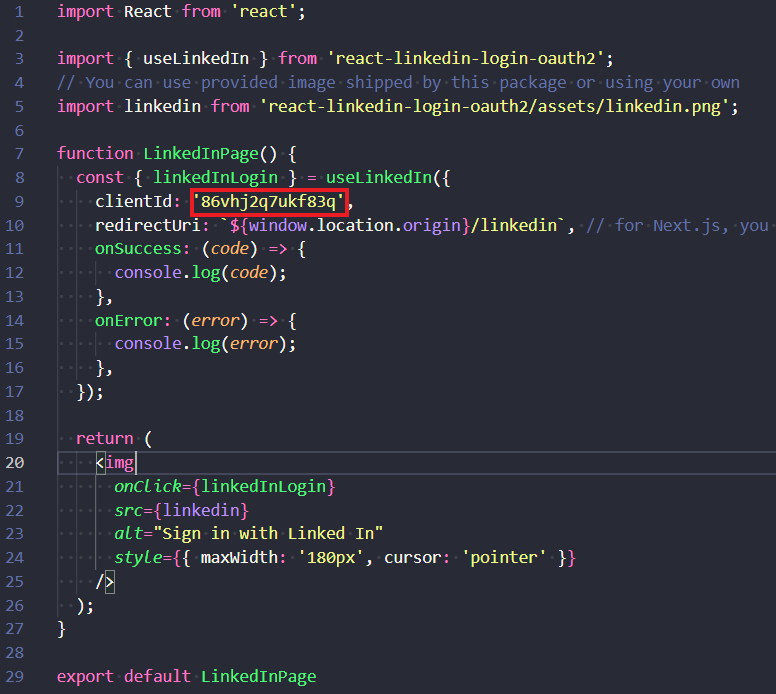
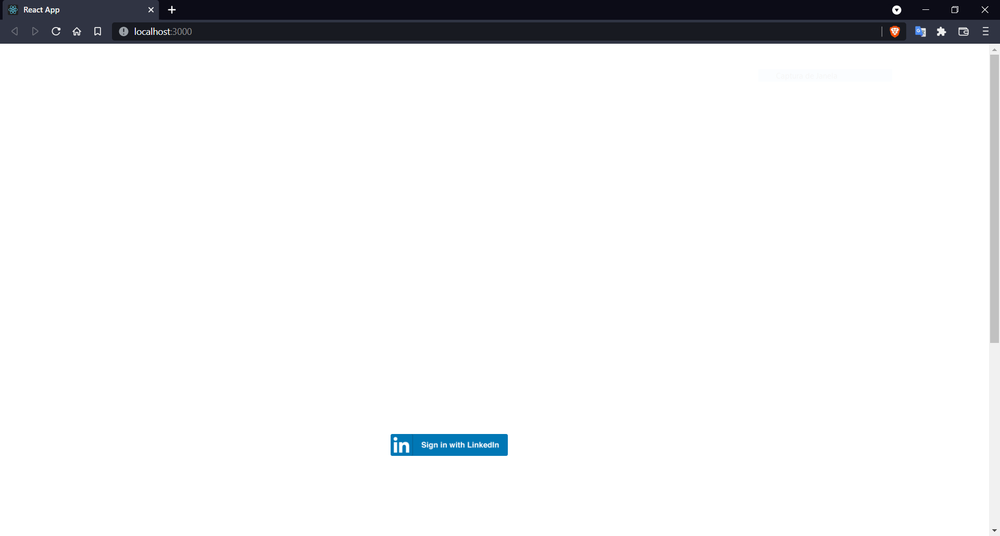
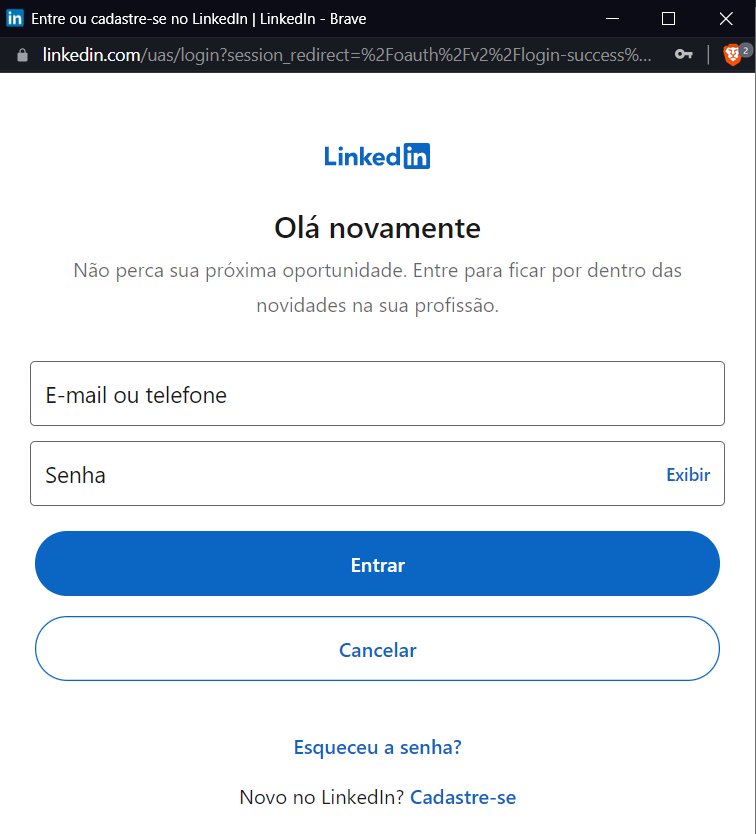

# Login LinkedIn

Install package ```npm install --save react-linkedin-login-oauth2@latest```

First, we create a button and provide required props:



You can register your key [here](www.linkedin.com/developers/tools/oauth)
Put your site key in the red tag

Have a LinkedIn Developer application to [create new application](https://www.linkedin.com/developers/apps/new)


## Authorization Code Flow

1. Configure your application in the Developer Portal to obtain Client ID and Client Secret.
2. Your application directs the browser to LinkedIn's OAuth 2.0 authorization page where the member authenticates.
3. After authentication, LinkedIn's authorization server passes an authorization code to your application.
4. Your application sends this code to LinkedIn and LinkedIn returns an access token.
5. Your application uses this token to make API calls on behalf of the member.


Exemple button:


Login LinkedIn


